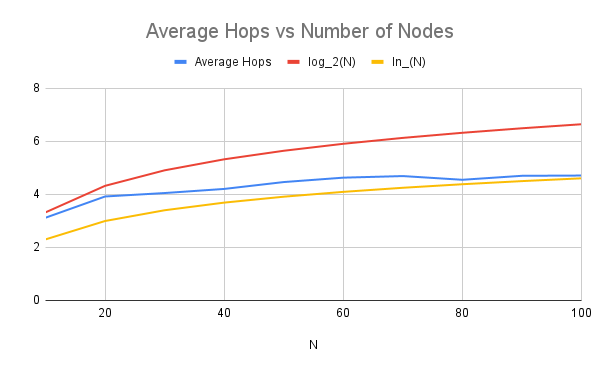

# Chord P2P System and Simulation

An Erlang implementation of the [Chord P2P protocol](https://en.wikipedia.org/wiki/Chord_(peer-to-peer)#cite_note-StoicaEtAl2001-1) and a simulator to collect statistics.

I implemented the Chord protocol per the specification in the [paper](https://pdos.csail.mit.edu/papers/ton:chord/paper-ton.pdf) with no failure. Chord ring creation, node join, and routing work as expected. 

#  Implementation 

## Overview

* Simulation supervisor in `sim_sup` takes in `Num_Nodes` and `Num_Requests`, chooses an appropriate value of `M`, spawns all node actors (assigning them an ID using consistent hashing), creates the chord ring, and joins nodes in the ring. The supervisor has nodes `stabilize` and `fix_fingers` after every new node joins. After all nodes join and the ring is stabilized, it then has every node make `Num_Requests` random `find_key` request (1 per node per 100 milliseconds) and reports the average hops necessary to resolve the requests. 

* Nodes are defined in `node.erl`. The are implemented as individual actors using `gen_server` behavior. They maintain state that includes `Supervisor_PID,Node_ID,Predecessor,FingerTable` (`Successor` is the first entry in the `FingerTable`). Every node supports a `join` function to join new networks in the node, a `stabilize` and `fix_fingers` function to optimize routing (along with `notify`,`find_successor`,`closest_preceding_node` functions to aid in these operations). To find a `key` (or the location a key should be - this is a simulation so no actual data is stored), nodes support a `key_lookup` function that uses `find_successor` and `closest_preceding_node` to do so optimally. On a call to `key_lookup` the requesting node starts the search and the resolving node reports to the supervisor the number of hops necessary to resolve said search.  

* I defined some utility functions in `util.erl` to handle consistent hashing and converting an ID (integer) to at atom to be able to cast and call nodes.

## Notes

* To combat node ID collisions I set a very conservative value for `M`, that being `M=2*log_2(Num_Nodes^2)`. This value was determined based on the [Birthday Attack](https://en.wikipedia.org/wiki/Birthday_attack).

* When I created a new chord ring I always had base nodes with `ID=0,2^M-1`, respectively. This ensured that a `Min_Node` and `Max_Node` always existed in the chord ring. These nodes were each other's successor and predecessor. These nodes were excluded from the `key_lookup` experiment. I found doing this helped with network joining and stabilization. 

# Running the Code

To run the code first compile all the src files:
```
erlc utils.erl
erlc node.erl
erlc sim_sup.erl
```

I use the depreciated module `crypto:random(...)` in `sim_sup.erl` which will throw a warning. I find this library easier to use than the now preferred `random` module.

Then to run:
```
erl -noshell -eval "sim_sup:run(Num_Nodes,Num_Requests)".
```

To exit `Ctrl+Z` after termination of a simulation.

# Testing

Below we see results for network sizes with `Num_Nodes = {10,20,30,40,50,60,70,80,90,100}`:



I set `Num_Requests = 10` for each network size. As expected, the average number of hops per key lookup is on the scale of `O(log(Num_Nodes))`. Note testing was limited, as I had limited time and only ran one trial per each network size. Raw data is available in the `/data` directory.

